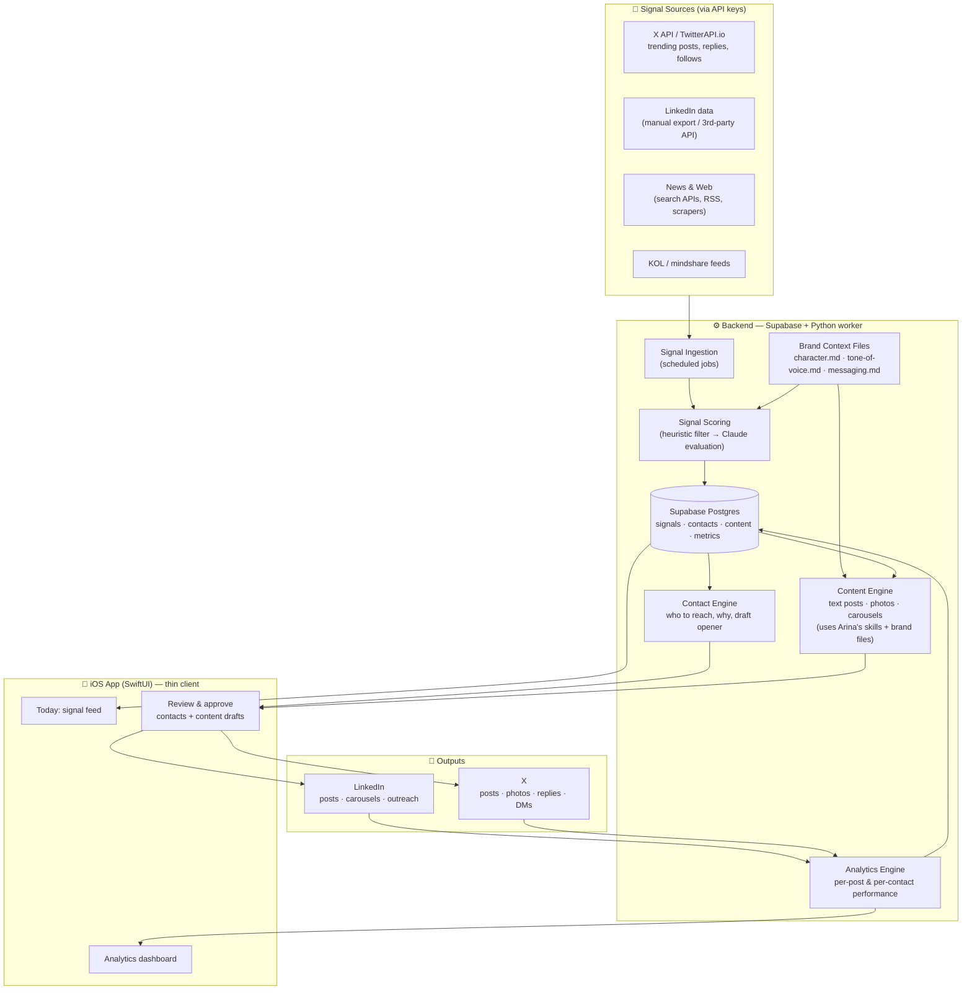

# Architecture — Personal Brand OS

The system is one loop: **Signals → Decisions → Contacts + Content → Publish → Analytics → back into Decisions.**

## High-level diagram

## Components

### 1. Signal Ingestion (`pipeline/01-signals.md`)
Scheduled jobs (Supabase cron / Python worker) pull from each source, normalize into a single `signals` table, dedupe. A signal = anything actionable: a viral post in Arina's niche, a person worth connecting with, a news hook, a conversation to join.

### 2. Signal Scoring
Two-phase, same proven pattern as job-agent:
1. **Heuristic pre-filter** — free, fast: keyword/topic match against messaging pillars, author follower thresholds, recency. Kills noise before any API spend.
2. **Claude evaluation** — scores survivors 0–5 on relevance to brand, suggests an action: `CONTACT`, `CONTENT`, `REPLY`, or `SKIP`.

### 3. Contact Engine (`pipeline/02-contacts.md`)
Signals tagged `CONTACT` become rows in `contacts` with a drafted opener (connection note / DM / reply), written in Arina's voice from the brand files. **Nothing auto-sends** — Arina approves in the iOS app, sends manually or via API where allowed.

### 4. Content Engine (`pipeline/03-content.md`)
Signals tagged `CONTENT` become drafts: text post, photo concept (AI image prompt), or carousel (slide-by-slide copy). Always grounded in `brand/*.md`. Arina's skills plug in here as generators/reviewers.

### 5. Analytics (`pipeline/04-analytics.md`)
Pulls post performance and contact outcomes back into the DB. Closes the loop: what topics/formats/hooks perform feed back into signal scoring weights.

### 6. iOS App
Thin SwiftUI client over Supabase. Three screens to start: **Today** (scored signals), **Review** (approve/edit drafts), **Stats** (dashboard). All heavy lifting happens server-side, so the app stays simple.

## Stack

| Layer | Choice | Notes |
|---|---|---|
| Frontend | **Next.js (App Router) web app, deployed on Vercel** | pivoted from iOS 2026-06-12; mobile-first responsive, installable as PWA later |
| DB / Auth / API | Supabase (Postgres, RLS, Edge Functions, cron) | confirmed target |
| Workers | **Next.js-native: route handlers + server functions + Vercel Cron** (decided 2026-06-19) | one codebase, one deploy; supersedes the Python-worker option |
| Signals | **SocialCrawl direct API** (`/v1/search/everywhere`) → normalize → heuristic score | live as of 2026-06-19; Claude scoring layers on next |
| AI | Claude API (scoring, drafting); image model TBD for photos | |
| Secrets | env vars locally, Vercel/Supabase env in prod | never in repo |

## Build phases

1. **Phase 0 (now)** — docs, schema, diagrams ✅ + frontend prototype with mock data (`web/`) ✅
2. **Phase 1** — Supabase schema live + one signal source ingesting + scoring
3. **Phase 2** — content & contact drafting with brand files
4. **Phase 3** — wire the web app to Supabase (replace mock data), deploy on Vercel
5. **Phase 4** — analytics loop + Stats screen with real data
